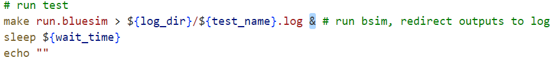

# MIT_CLASS_lab

## 文件说明

- class_source_code文件夹：收集的课程提供的程序
- bsv_prj文件夹：课程学习过程中，完成的或开发中的代码

## 开发环境

感谢作者kazutoiris提供的[connectal-docker](https://github.com/kazutoiris/connectal-docker)

### 我的Docker Composer example

```
services:
  connectal:
    image: kazutoiris/connectal:latest
    volumes:
      - ".:/root"
    network_mode: none
    tty: true
    stdin_open: true
```

如果在WSL上运行docker，可能无法正常启动container。
所以需要添加以下的两行代码：

```
    tty: true
    stdin_open: true
```

如果在WSL上运行docker，直接进入container，使用BSC编译时，提示没有权限无法生成文件导致编译中断。

先退出container，再使用以下代码重新进入：

```
docker exec -it --privileged=true -u=root 【container name or ID】 /bin/bash
```

WSL默认用户名是root，如果不是，那么将代码中的‘root’替换为目标用户名。

## Lab开发记录

- Lab2：对有数字电路经验的同学，可以不用看电路了，但是还是要先看PPT，按照课件PPT设计思路，增加一个add_n的function，别直接用‘+’！！！
- Lab3：具体见6.175Lab3 Exercise2.md

### RISCV

#### Lab5:

1. 开发环境搭建：
   riscv-gcc编译工具链：github上有prebuild的工具链，直接下载下来解压到/opt/riscv
   elf2hex：可以从此链接获取([elf2hex](https://github.com/riscvarchive/riscv-fesvr))，不过需要编译。我已经编译好并上传了，可以直接下载下来放到/opt/riscv/bin
2. 几个注意事项：
   run_xxx.sh脚本修改：在脚本里去掉这个`&`，如果不去掉，你的测试程序会在后台同时运行好多个，导致仿真时间极长而且会把CPU使用率占到100%。

   

   programs/assembly programs/benchmarks下的makefile：最近的riscv-isa将csr单独作为了一项扩展指令集，这个程序有点老了，用新的gcc直接编译会报-zicsr错误，需要在march后面添加_zicsr，具体方法请查看我lab5下的makefile。

   /logs：仿真时会产生log文件，如果你的riscv设计错误，在仿真时可能会一直在log文件里打印调试信息，log文件会变的超级大，这时你可以选择ctrl+c中断仿真或者在程序里加入$finish主动中断。

   main.cpp：我找到的课程代码中第31行`(1>>16)`应该修改为`(1<<16)`
3. 个人建议/提示：

   指令集学习：初学的话可以不用看完全部指令集，主要是看看JAL/JALR/branch这些命令（这些跟PC控制有关）

   调试：建议在每一个阶段插入$display，打印出对应阶段的调试信息。

   错误排查：在programs/build/XX/dump/目录下会生成很多.dump文件，dump文件中包含了PC和与之对应的指令，可以通过对比打印的调试信息排查错误情况。例如：如果是跳转错误那么PC就对应不上。
4. Exercise设计：

   -- Exercise1：设计一个von Neumann架构的twocycle核，注意此设计是使用一个mem，课程代码提供的onecycle使用了两个mem。

   -- Exercise2：设计一个fourcycle核，注意此设计需要使用一个delayed memory，所以需要在fetch阶段先请求数据，在decode阶段拿到数据（指令）再进行处理。

   -- Exercise3：

   -- Exercise4：
5. e
6. e

## BSV语法记录

### rule

- guard : 如果guard不成立，rule内的所有逻辑都不会运行。

BSC编译：

- BSC会并行展开电路，并行解析后再组合成目标电路，所以理论上BSC的编译速度会比Verilog类似的编译器更快。
