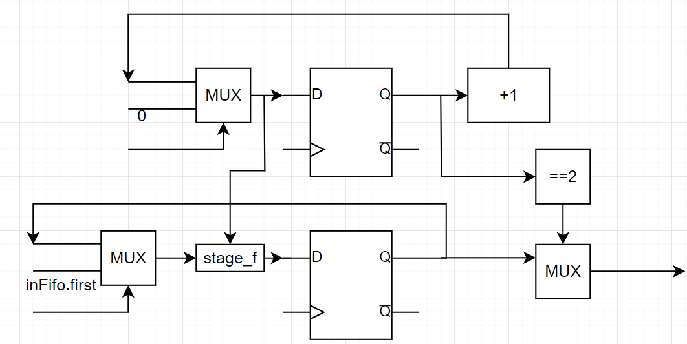
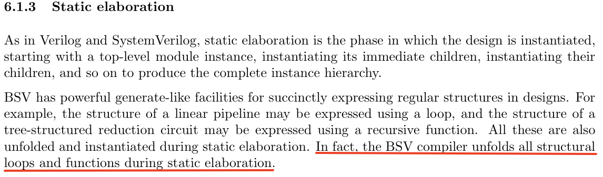

I meet a bug in Exercise2, the log shows:

```
Error: "Fft.bsv", line 70, column 24: (G0002)
  `bfly_0.bfly4' needs more than 1 ports for the following uses:
      `bfly_0.bfly4 _3_QUOT_2_PLUS_0_CONCAT_stage_9_4_SRL_6_5_6_56__ETC___d366
      IF_inFifo_da_virtual_reg_1_read__09_OR_inFifo__ETC___d368' at "Fft.bsv",
      line 70, column 24
      `bfly_0.bfly4 _3_QUOT_2_PLUS_0_CONCAT_stage_9_4_SRL_6_5_6_56__ETC___d366
      stage_reg_22_BITS_63_TO_0___d498' at "Fft.bsv", line 70, column 24
```

At first, i think it might be like "multi drive" in verilog. Then i made a few test(test code below)

```
        if( stage == 0) begin
            inFifo.deq;
            stage_reg <= stage_f(stage, inFifo.first);
        end else if(stage == 1) begin
            stage_reg <= stage_f(stage, stage_reg);
        end else begin
            outFifo.enq(stage_f(stage, stage_reg));
        end
```

Make test by removing `stage_f`in each line one by one, the result is:

- As long as there are more than one `stage_f`, compiler will show `more than 1 ports`
- leave any one of these alone, compiler does not show `more than 1 ports`

Then find some reference code, they all made an intermedia variable, which makes the code more accurate to the circuit that we want.



According to above, this not "multi drive". So, i suppose BSC compile logic is:

- list all logic in parallel
- merge these logic base on user action condition

And i find an evidence in BSV_reference-guide.pdf



***So, the conclusion is when i implemente `stage_f` , BSV compiler unfold it, and analyse the input in parallel before merge logic.***

In this test code, when BSV compiler unfold `stage_f`, there will be 3 `stage_f`, but when BSV compiler merge `stage_f`,it shows error ,because i give three different inputs.
